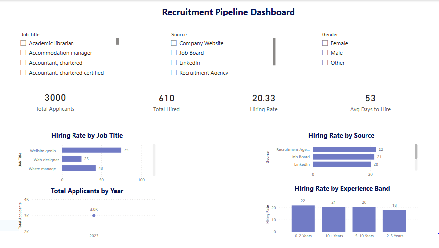

# Project: Recruitment Pipeline Analysis

## Overview
Interactive Power BI dashboard analysing recruitment
pipeline performance and hiring funnel metrics using
a dataset of 2000+ applicants

## Tools Used
- SQL (window functions, RANK, PARTITION BY,
  JULIANDAY, aggregations)
- Power BI (DAX measures, Power Query, dashboard design)
- DB Browser for SQLite
- Excel (data preparation)

## Key Findings
- Overall hiring rate across all roles and sources
- Referral source showed highest conversion rate
- Identified roles with longest time-to-hire
- Experienced candidates (5-10 years) had highest
  hiring success rate

## DAX Measures Used
- Total Applicants (COUNTROWS)
- Total Hired (CALCULATE)
- Hiring Rate (DIVIDE)
- Avg Days to Hire (AVERAGE + CALCULATE)
- Total Rejected (CALCULATE)

## SQL Queries
- Overall hiring rate calculation
- Hiring rate by job title
- Source effectiveness analysis
- Average time to hire by role
- Advanced window functions (RANK, PARTITION BY)
- Experience band vs hiring success

## Dashboard Features
- 4 KPI cards (Applicants, Hired, Rate, Days to Hire)
- Hiring rate by job title (bar chart)
- Source effectiveness chart
- Applications over time (line chart)
- Experience band analysis (column chart)
- 3 interactive slicers (Job Title, Source, Gender)

## Files
- recruitment_queries.sql — all 6 SQL queries
- recruitment_dashboard_screenshot.png — preview
- Recruitment_Pipeline_Dashboard.pbix — Power BI file

## Dashboard Preview

